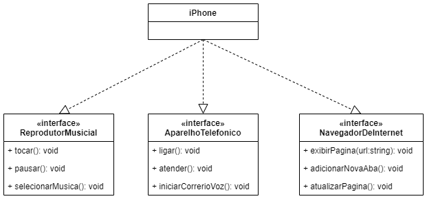

# Orientação a Objetos e UML: Diagramação de Classes do iPhone
Este repositório contém a representação UML de um desafio do Santander Bootcamp 2023, modelando um iPhone com funcionalidades de reprodutor de música, telefone e navegador de internet.

Desafio DIO:  Diagramação de Classes do iPhone

Diagramação das classes e interfaces do iPhone de: Reprodutor Musical, Aparelho Telefônico e Navegador na Internet.

